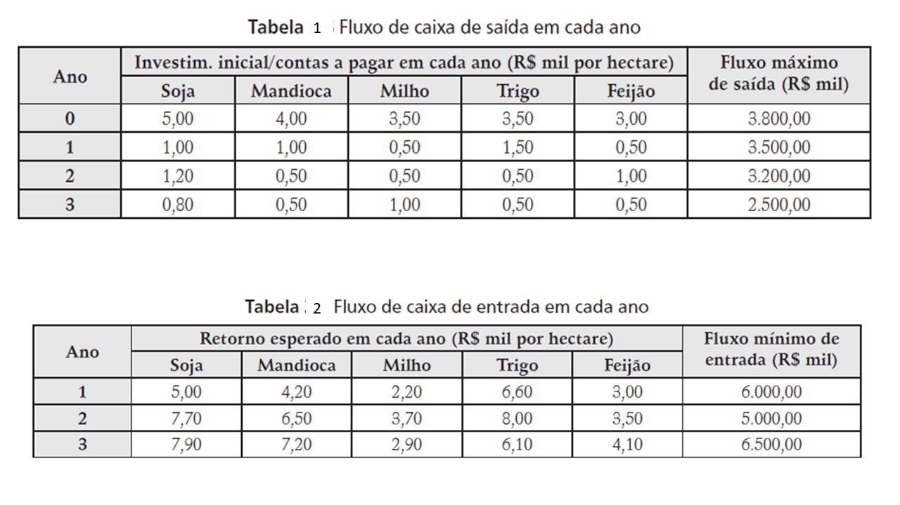

```{r setup, include=FALSE}
knitr::opts_chunk$set(echo = TRUE)
options(scipen = 999)
```

## O problema

Um fazendeiro está considerando cinco tipos de investimentos em atividades de cultura (soja, mandioca,
milho, trigo e feijão) em sua nova fazenda, que possui área total disponível de 1.000 hectares. 

## Levantamento dos dados

Cada atividade de cultura exige investimentos de capital que gerarão benefícios futuros. O investimento inicial e as contas a pagar nos próximos três anos, para cada atividade de cultura, estão especificados na Tabela 1. O retorno esperado nos próximos três anos, para cada investimento de cultura, está especificado na
Tabela 2. 

O fazendeiro possui limitação de recursos a serem investidos em cada período (última coluna
da Tabela 1) e espera um fluxo mínimo de entrada em cada período (última coluna da Tabela 2).



A taxa de juros, para cada atividade de cultura, é de 10% a.a. A partir da área total disponível para investimento,
o fazendeiro quer determinar quanto investir em cada cultura (em hectares), de forma a maximizar o VPL
do conjunto de projetos de investimento em análise, respeitando os fluxos mínimo de entrada e máximo
de saída em cada período. 

##Formulação do problema de programação linear do fazendeiro.

###Variáveis de Decisão

$x_i =$ área total em hectares a ser investida para a cultura da atividade i, $i=1, 2, ..., 5$

###Restrições do problema

1. Capacidade máxima disponível para as atividades de cultura:

$x_1+x_2+x_3+x_4+x_5 \leq 1000$

2. Fluxo mínimo de entrada para cada ano (R\$ mil):

$5.0x_1+4.2x_2+2.2x_3+6.6x_4+3.0x_5 \geq 6000$ (1o. ano)

$7.7x_1+6.5x_2+3.7x_3+8.0x_4+3.5x_5 \geq 5000$ (2o. ano)

$7.9x_1+7.2x_2+2.9x_3+6.1x_4+4.1x_5 \geq 6500$ (3o. ano)

3. Fluxo máximo de saída para cada ano (R\$ mil):

$5.0x_1+4.0x_2+3.5x_3+3.5x_4+3.0x_5 \leq 3800$ (investimento inicial)

$1.0x_1+1.0x_2+0.5x_3+1.5x_4+0.5x_5 \leq 3500$ (1o. ano)

$1.2x_1+0.5x_2+0.5x_3+0.5x_4+1.0x_5 \leq 3200$ (2o. ano)

$0.8x_1+0.5x_2+1.0x_3+0.5x_4+0.5x_5 \geq 2500$ (3o. ano)

4. Restrições de não negatividade das variáveis de decisão:

$x_i \geq 0$, $i=1, 2, ..., 5$

###Função Objetivo


$max z = 9.343x_1 + 8.902x_2 + 2.118x_3 + 11.542x_4 + 4.044x_5$


##A solução do problema

```{r echo=FALSE}
# coeficientes nas restrições.
# $x_1+x_2+x_3+x_4+x_5 \leq 1000$
R1=c(1, 1, 1, 1, 1) 
#$5.0x_1+4.2x_2+2.2x_3+6.6x_4+3.0x_5 \geq 6000$ (1o. ano)
R2=c(5, 4.2, 2.2, 6.6, 3)

#$7.7x_1+6.5x_2+3.7x_3+8.0x_4+3.5x_5 \geq 5000$ (2o. ano)
#
R3=c(7.7, 6.5, 3.7, 8.0, 3.5)

#$7.9x_1+7.2x_2+2.9x_3+6.1x_4+4.1x_5 \geq 6500$
R4=c(7.9, 7.2, 2.9, 6.1, 4.1)

#$5.0x_1+4.0x_2+3.5x_3+3.5x_4+3.0x_5 \leq 3800$ (investimento inicial)
R5 = c(5, 4, 3.5, 3.5, 3)

#$1.0x_1+1.0x_2+0.5x_3+1.5x_4+0.5x_5 \leq 3500$ (1o. ano)
R6 = c(1, 1, 0.5, 1.5, 0.5)

#$1.2x_1+0.5x_2+0.5x_3+0.5x_4+1.0x_5 \leq 3200$ (2o. ano)
R7 = c(1.2, 0.5, 0.5, 0.5, 1)

#$0.8x_1+0.5x_2+1.0x_3+0.5x_4+0.5x_5 \geq 2500$ (3o. ano)
R8 = c(0.8, 0.5, 1, 0.5, 0.5)


coeficientes.restricoes <- rbind(R1, R2, R3, R4, R5, R6, R7, R8)

# sinal das restrições. 
direcao.restricoes <- c("<=",rep(">=",3),rep("<=",4))

# limite das restrições. 
limites.restricoes <- c(1,6,5,6.5,3.8,3.5,3.2,2.5)*1000


#Calculo do VPL
#i=taxa de juros; n= número de períodos
i=0.1
n=3
M=coeficientes.restricoes
#Ci é o VPL da cultura i
c1=sum(M[2:4,1]/rep(1+i,n)^(1:n))-M[5,1]-sum(M[6:8,1]/rep(1+i,n)^(1:n))

c2=sum(M[2:4,2]/rep(1+i,n)^(1:n))-M[5,2]-sum(M[6:8,2]/rep(1+i,n)^(1:n))

c3=sum(M[2:4,3]/rep(1+i,n)^(1:n))-M[5,3]-sum(M[6:8,3]/rep(1+i,n)^(1:n))

c4=sum(M[2:4,4]/rep(1+i,n)^(1:n))-M[5,4]-sum(M[6:8,4]/rep(1+i,n)^(1:n))

c5=sum(M[2:4,5]/rep(1+i,n)^(1:n))-M[5,5]-sum(M[6:8,5]/rep(1+i,n)^(1:n))

# coeficientes na função objetivo 
# 9.343x_1 + 8.902x_2 + 2.118x_3 + 11.542x_4 + 4.044x_5
# 
func.objetivo <- c(c1,c2,c3,c4,c5)


solucao.problema <- lpSolve::lp(direction = "max",      objective.in = func.objetivo,  
                               const.mat = coeficientes.restricoes,
                               const.dir = direcao.restricoes,
                               const.rhs = limites.restricoes, 
all.int=F,  compute.sens = 1)

# valor da função objetivo na solução
solucao.problema$objval

# Valores para as variáveis de escolha que geram máximo ou mínimo dependendo do problema
solucao.problema$solution


```


#Análise de sensibilidade

Realizar a análise de sensibilidade, ou seja, quanto é possivel variar os investimentos sem alterar as áreas de cultivo de cada cultura?

```{r}
round(solucao.problema$sens.coef.from,2)
round(solucao.problema$sens.coef.to,2)
```


Qual o impacto no VPL se o fazendeiro puder aumentar a área de cultivo? E se precisar diminuir?

```{r}
#O quanto aumenta/diminui no valor da função objetivo se aumentamos/diminuimos 1 unidade de recurso em cada respectiva restrição
solucao.problema$duals

#Intervalos válidos para aumentar/diminuir recursos e manter a taxa de variação na função objetivo
round(solucao.problema$duals.from,2)
round(solucao.problema$duals.to,2)
```


